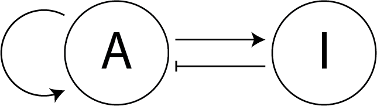

&larr; previous - [home](https://guignardlab.github.io/CenTuri-Course/) - [next &rarr;](1-Variables.md)

# Table of contents

0. [Introduction](0-Introduction.md) &larr; ([Notebook](../0-Introduction.ipynb))
1. [Variables](1-Variables.md)
2. [Data structures](2-Data-Structures.md)
3. [Conditional statements and loops](3-Conditional-Statements-Loops.md)
4. [Some exercises](4-Some-Exercises.md)
5. [Introduction to functions](5-0-Introduction-function.md)
    1. [File manipulation](5-1-File-manipulation.md)
6. [From 0D to 1D](6-1-From-0D-to-1D.md)
    1. [Adding lateral diffusion](6-2-Adding-lateral-diffusion.md)
7. [From 1D to 2D](7-From-1D-to-2D.md)
8. [Playing with the model](8-Playing-with-the-model.md)

# Introduction to Python with Turing patterns

## 0. Introduction

**First of, within this course [this page](https://docs.python.org/3/tutorial/index.html) will be mentioned a lot. It is a really good (maybe a bit crude) source for information and it is the official Python page so it should also be quite accurate.**

**Moreover, if you would like to read more about python, you can find a good list of books about Python [there](https://wiki.python.org/moin/PythonBooks) (not all of them are free).**

**Here are two free online books that could be worth reading to go further:**
- **[IPython Cookbook, Second Edition (2018)](https://ipython-books.github.io/) In depth book about python. While the book is of general interest and definitely worth reading, [that](https://ipython-books.github.io/124-simulating-a-partial-differential-equation-reaction-diffusion-systems-and-turing-patterns/) part was especially helpful for this course**
- **[From Python to Numpy](https://www.labri.fr/perso/nrougier/from-python-to-numpy/) Especially useful when wanting to use Numpy, which you probably should!**

### 0.1 Goal of this course
This course aims at teaching the basics of coding using reaction diffusion simulations as a support, more specifically the Turing patterns.
Understanding the mathematics or the biology behind the Turing patterns is not necessary but it might help to understand better what is happening behind the hood.

At the end of the course, we would like you to be able to write small pieces of code to do basic data analysis.
No computation level is required though it is good to keep in mind that at the time being, this notebook alone might not be enough: the teachers are still necessary (unfortunately?) to introduce the concepts and to help answer the potential questions.

### 0.2 Coding in Python
The goal of this course is for you to learn the basics of __coding__ in __Python__, but what does that really mean, or more specifically, what do we (the "teachers") mean?

#### 0.2.1 What is coding?
Coding is giving a set of instructions to a computer for it to do a task.
The tasks can be as trivial as:
```
Give the result of 1 + 0
```
or, slightly more complex:
```
If the key 'a' from the keyboard is stroke, display the letter 'a' on the screen
```
or quite complex:
```
Help proving the 4-colour theorem
```
(see [Computer-assisted proofs](https://en.wikipedia.org/wiki/Computer-assisted_proof))

#### 0.2.2 Programmation language
To communicate and give instructions to a computer and mainly the Computer Processing Unit (CPU), it is necessary to write the said instructions in a language that the CPU can indeed understand.

There is an extremely large number of programming languages (635 listed on this [wikipedia page](https://en.wikipedia.org/wiki/List_of_programming_languages)). For example C++, Visual Basic, Java, R, Go, ...

In this class we will use Python as our language of choice.
This choice that was mainly driven by three reasons:
- it is the language that I and many teachers of this class are most comfortable with
- it is an open source language
- it is probably the open source language that is today the mostly used in biology and data science

Supporting the previous claims, the [TIOBE Programming Community index rank](https://www.tiobe.com/tiobe-index/) ranks python in the top 3 of the currently most popular programming languages.

#### 0.2.3 What computers are good and not so good at
It is also important to understand what computers are good at and not so good at.
Computers have strengths and weaknesses. They are especially good at:
- performing basic operations: additions, multiplications, ...
- accessing their short and long term memory

For example, current common processors are working at $2.5GHz\simeq 2.5\times 10^9$ actions per second, meaning that if you would perform 1 action every second it would take you about 800 years to perform as many actions as a computer is doing in one second.

Computers are also good at storing information and accessing it.
Computers can store about 1TB of data in "slow-to-access" memory and about 32GB of data in fast access memory (RAM).
To put that in context, 1 hour of Netflix movie in HD weighs about 3GB, so 3TB is 1000 hours of Netflix movie which is about 42 days of film.

On top of that, computers can access the data in memory quickly.
Computers can read from 80 to 160MB per second, Solid State Drives (SSD) can read at a speed of 550MB per seconds.
In other words, a computer can learn "by heart" the whole _A song of Ice and Fire_ series in about a second.
Finally, Random Access Memory (RAM), which is the memory that directly exchanges information with the CPUs read at a speed of about 1500MHz.
(Note that for read/write intensive processes it can become a limiting factor for the overall processing speed)

On the flip side, computers are not good at everything. For example, they are bad at:
- Pattern recognition
- Being creative (building hypotheses, making jokes, writing good novels, ...)
- Anything that doesn’t have pre-existing data for

Though, these limitations have been pushed back significantly recently thanks to the artificial intelligence and deep learning revolution:
One very notable, recent example: [AlphaGO](https://www.deepmind.com/research/highlighted-research/alphago), the first program that beat a human at the GO game. For the first time, computers could have intuition-like behaviours that are better than humans and even that we cannot understand.

#### 0.2.4 Learning a programming language
Therefore, to code, you need to learn a programming language (here Python).
Programming languages are all at least somewhat different and have specific rules but most of them rely on a common set of paradigms:
- they have variables
- they have data structures (list, heaps, hashmaps, ...)
- they have conditional statements
- they have functions (not always)

Before being able to write some code, it is important to go through these basic and mostly common "rules"

### 0.3 Turing patterns
Now about Turing patterns, they were introduced by Alan Turing in the article [The Chemical Basis of Morphogenesis](https://www.dna.caltech.edu/courses/cs191/paperscs191/turing.pdf).
They will not be much discussed here but feel free to ask questions or to look over [there](https://en.wikipedia.org/wiki/Reaction%E2%80%93diffusion_system) for more information.

What is important to keep in mind is that in its simplest form, a Turing pattern is the result of the interaction between an activator and its inhibitor and their co-diffusion across a set of cells.

It is this interaction and diffusion that we will model in this course. We will also learn how to graphically represent these patterns.

A little bit of knowledge about how to model these interactions is necessary to better understand the remainder of the course.
First, we will be talking about an activator that will name $A$ and an inhibitor that will name $I$. Their concentration values will be refered to as $a$ and $i$ respectively.

The gene regulation network that we are considering here is the simple one where $A$ auto-activates and activates $I$ and $I$ inhibits $A$:



> _**To go a little bit further (not required):**_
>
> From this network, we can extract the interaction between activator $A$ and an inhibitor $I$ as follow:
>
> $A \rightarrow A$ ($A$ is auto activated)
>
> $A \rightarrow I$ ($A$ activates $I$)
>
> $I \dashv A$ ($I$ inhibits $A$)
>
> These interactions can be modelled multiple ways.
> We decided here to use the [FitzHugh–Nagumo model](https://en.wikipedia.org/wiki/FitzHugh%E2%80%93Nagumo_model) (for no particular reason) resulting in the following equations:
>
> $\frac{\delta a}{\delta t} = \mu_a\nabla^2 a + a - a^3 - i + k$ [1]
>
> $\tau \frac{\delta i}{\delta t} = \mu_i\nabla^2 i + a - i$ [2]
>
> These are partial differential equations that represent the change of concentration of $A$ ($\delta a$) or $I$ ($\delta i$) in time ($\delta t$).
>
> In equation [1], $\nabla^2 a$ is the potential diffusion $A$ and $\mu_a$ is the diffusion coefficient.
> $+ a$ is the auto-activation of $A$, $-a^3$ is the degradation, $-i$ is the inhibition from $I$ and $k$ is a constant to determine whether $A$ acts as a source ($0<k$), a sink ($k<0$) or is neutral ($k=0$).
>
> In equation [2], $\nabla^2 i$ is the potential diffusion of $I$ and $\mu_i$ is the diffusion coefficient.
> $+a$ is the activation from $A$, $-i$ is the degradation and $\tau$ allows to modulate the amplitude of change of concentration of $I$ compared to the one of the activator $A$.

It is important to know that to model the previous network it is necessary to decide on some values, the parameters of the model:
- the diffusion coefficients $\mu_a$ and $\mu_i$ (referred to as `mu_a` and `mu_i` in the code)
- the constant $\tau$ (referred to as `tau`)
- the constant $k$ (referred to as `k`)

Because we will solve the differential equations numerically (as opposed to analytically) using "simple" numerical models, we will fix the value of $\delta t$. Therefore:
- $\delta t$ is a parameter (referred to as `dt`)

Moreover other values are necessary for the computation also need to be decided:
- the size of the grid we will be working on, ie the number of cells considered (referred to as `size`)
- the distance between two cells (ie the space step: `dx` and `dy`)
- the total time of the simulation (`T`)
- the number of iterations (`n`, which is determined by the ratio of `T` over `dt`)

&larr; previous - [home](https://guignardlab.github.io/CenTuri-Course/) - [next &rarr;](1-Variables.md)