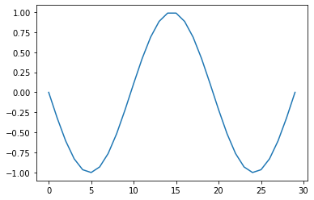
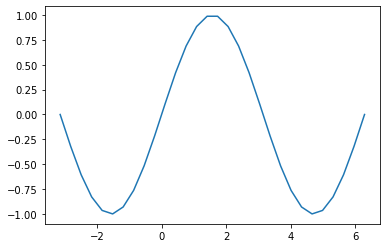
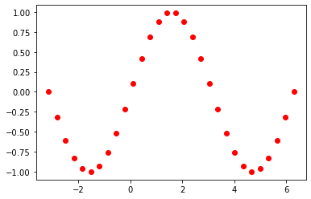
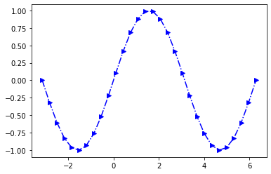

&larr; previous - [home](https://guignardlab.github.io/CenTuri-Course-2022/) - [next &rarr;](../3-4-Figures-and-Subplots/3-4-Figures-and-Subplots.md)

# Table of contents
* [1-2 Introduction and Line plots](../1-2-Intro-and-Line-plots/1-2-Intro-and-Line-plots.md) &larr; ([Notebook](../../../01-02-Intro-and-Line-plots.ipynb))
* [3-4 Figures and Subplots](../3-4-Figures-and-Subplots/3-4-Figures-and-Subplots.md)
* [5-6 Styles and Aesthetics](../5-6-Styles-and-Aesthetics/5-6-Styles-and-Aesthetics.md)
* [7-8 Saving and Color maps](../7-8-Saving-and-Color-maps/7-8-Saving-and-Color-maps.md)
* [9 Histograms](../9-Histograms/9-Histograms.md)
* [10-11 Boxplots Violinplots and Scatter plots](../10-11-Boxplots-Violinplots-and-Scatter-plots/10-11-Boxplots-Violinplots-and-Scatter-plots.md)
* [12 Animations](../12-Animations/12-Animations.md)

# Visualising data using matplotlib

__*We will not look at 3D plots!*__

In this course we will look at how to plot data using `matplotlib`.
The following [cheatsheets](https://matplotlib.org/cheatsheets/) will be quite useful, for the class and for later.
Also, I used a lot the following [book](https://github.com/rougier/scientific-visualization-book) to prepare this course together with the original matplotlib [manual](https://matplotlib.org/stable/index.html).

You are strongly advised to have a look at these links for the course.

In this course, we will have a look at usual line plots, box plots, violin plots, scatter plots and how to make animations.

## 1. Loading the necessary libraries
---
The first step is to import matplotlib and its main class pyplot


```python
import matplotlib as mpl
import matplotlib.pyplot as plt
```

Then, we can use a special matplotlib command:
```python
%matplotlib inline
```
to be able to easily visualize the plot in our notebook.

Note that it is not necessary to run that line in all browsers.
Moreover, you can use the following line:
```python
%matplotlib notebook
```

It gives more freedom with the plots but I personally like it less since it puts the focus on the figure and requires more steps to go back to the code.


```python
%matplotlib inline
```

## 2. Line plots
---

Now that we are set up, let's create our first plot.

But first, we need to create the data that we will want to plot:


```python
import numpy as np
Y = np.sin(np.linspace(-np.pi, 2*np.pi, 30))
```

We can then plot the line that we created the following way:


```python
plt.plot(Y)
```


    [<matplotlib.lines.Line2D at 0x10fda0e20>]


    

    


We are plotting what we want but, the `x` values are not the correct ones (in  instead of ).

The reason is that we are only giving the `y` axis values (note that they are indeed ranging in ). So let's give the `x` values:


```python
X = np.linspace(-np.pi, 2*np.pi, 30)
Y = np.sin(X)
plt.plot(X, Y)
```


    [<matplotlib.lines.Line2D at 0x10ff973d0>]


    

    


Matplotlib, by default, shows us such data as blue lines between data points. We can change that and show only the measured points in red:


```python
plt.plot(X, Y, marker='o', linestyle='', color='red')
```


    [<matplotlib.lines.Line2D at 0x11e80f220>]


    

    


You can find all the different kind of markers, line styles and colours in the [cheatsheet](https://github.com/matplotlib/cheatsheets#cheatsheets) mentioned before.

Moreover, matplotlib is "nice" and, because the marker, linestyle and colour are properties that are often changed they allow an easier way to modify them:


```python
plt.plot(X, Y, 'or')
```


    [<matplotlib.lines.Line2D at 0x11e87ef20>]


    

    


```python
plt.plot(X, Y, 'b-.>')
```


    [<matplotlib.lines.Line2D at 0x11e8e2aa0>]


    

    

&larr; previous - [home](https://guignardlab.github.io/CenTuri-Course-2022/) - [next &rarr;](../3-4-Figures-and-Subplots/3-4-Figures-and-Subplots.md)
