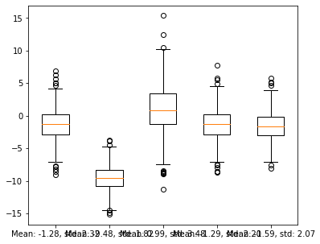
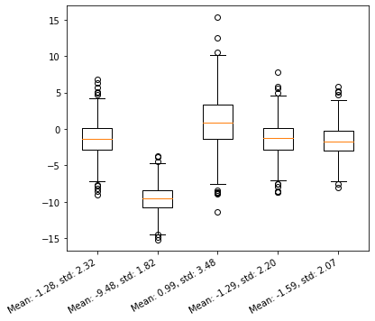
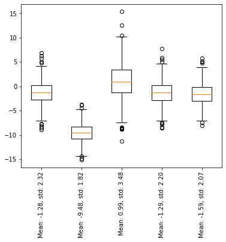
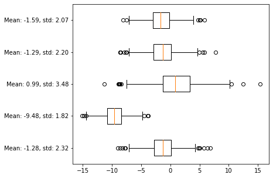
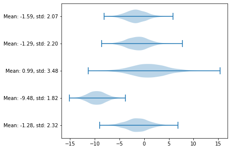
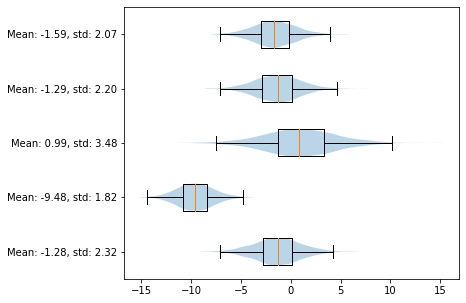
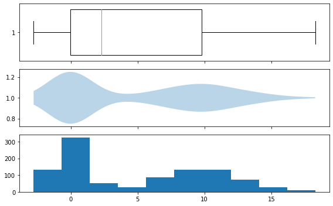
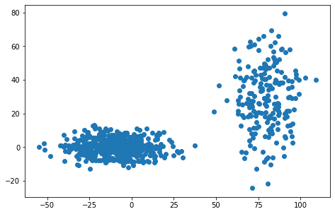
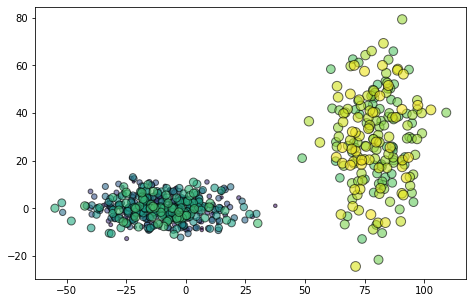

[&larr; previous](../9-Histograms/9-Histograms.md) - [home](https://guignardlab.github.io/CenTuri-Course-2022/) - [next &rarr;](../12-Animations/12-Animations.md)

# Table of contents
* [1-2 Introduction and Line plots](../1-2-Intro-and-Line-plots/1-2-Intro-and-Line-plots.md)
* [3-4 Figures and Subplots](../3-4-Figures-and-Subplots/3-4-Figures-and-Subplots.md)
* [5-6 Styles and Aesthetics](../5-6-Styles-and-Aesthetics/5-6-Styles-and-Aesthetics.md)
* [7-8 Saving and Color maps](../7-8-Saving-and-Color-maps/7-8-Saving-and-Color-maps.md)
* [9 Histograms](../9-Histograms/9-Histograms.md)
* [10-11 Boxplots Violinplots and Scatter plots](../10-11-Boxplots-Violinplots-and-Scatter-plots/10-11-Boxplots-Violinplots-and-Scatter-plots.md) &larr; ([Notebook](../../../10-11-Boxplots-Violinplots-and-Scatter-plots.ipynb))
* [12 Animations](../12-Animations/12-Animations.md)
* [13 On the usage of Seaborn](../13-Seaborn/13-Seaborn.md)

## 10. Boxplots and violin plots
Another way to look at distribution is to use boxplots:


```python
import numpy as np
import matplotlib as mpl
import matplotlib.pyplot as plt

np.random.seed(2)
mean = np.random.uniform(-10, 10, size=5)
std = np.random.uniform(1, 5, size=5)
data = np.random.normal(loc=mean, scale=std, size=(1000, 5))
labels = [f'Mean: {m:.2f}, std: {s:.2f}' for m, s in zip(mean, std)]
```


```python
fig, ax = plt.subplots(figsize=(6, 5))
ax.boxplot(data, labels=labels);
```


    

    


Slightly better but the labels are overlapping.

We can modify that by changing the setting the labels afterwards:


```python
fig, ax = plt.subplots(figsize=(6, 5))
ax.boxplot(data)
ax.set_xticklabels(labels, rotation=30, ha='right');
```


    

    


```python
fig, ax = plt.subplots(figsize=(6, 5))
ax.boxplot(data)
ax.set_xticklabels(labels, rotation=90);
```


    

    


Though, as a general point, it is not advised to ask your reader/audience to bend their head.
A far better solution is the following:


```python
fig, ax = plt.subplots(figsize=(6, 5))
ax.boxplot(data, labels=labels, vert=False);
```


    

    


A similar way to visualise your data is using violin plots:


```python
fig, ax = plt.subplots(figsize=(6, 5))
ax.violinplot(data, vert=False);
ax.set_yticks(range(1, data.shape[1]+1))
ax.set_yticklabels(labels);
```


    

    


Or combining both since they provide since they don't provide exactly the same informations


```python
fig, ax = plt.subplots(figsize=(6, 5))
ax.boxplot(data, labels=labels, vert=False, zorder=100, sym='')
ax.violinplot(data, showextrema=False, vert=False);
```


    

    


When looking at unimodal distribution, looking at boxplots is sufficient, it is not the case for multimodal distributions, we are losing too much information:


```python
np.random.seed(0)
d1 = np.random.normal(0, 1, size=500)
d2 = np.random.normal(10, 3, size=500)
d_multi = np.hstack([d1, d2])
```


```python
fig, ax = plt.subplots(3, 1, figsize=(8, 5), sharex=True)
ax[0].boxplot(d_multi, vert=False, widths=.8);
ax[1].violinplot(d_multi, showextrema=False, vert=False);
ax[2].hist(d_multi);
fig.tight_layout()
```


    

    


## 11. Scatter plots
Scatter plots are useful when one wants to look at two measurements from and their potential correlation


```python
X = np.random.normal(-10, 15, size = 500)
Y = np.random.normal(0, 5, size = 500)
X = np.hstack([X, np.random.normal(80, 10, size = 200)])
Y = np.hstack([Y, np.random.normal(30, 20, size = 200)])
fig, ax = plt.subplots(figsize=(8, 5))
ax.scatter(X, Y)
ax.set_aspect('equal')
```


    

    


Colours and sizes can be assigned to each point:


```python
cmap = mpl.cm.get_cmap('viridis')
colors = np.linspace(0, 1, 700)
sizes = np.linspace(5, 100, 700)
fig, ax = plt.subplots(figsize=(8, 5))
ax.scatter(X, Y, color=cmap(colors), s=sizes, alpha=.6, edgecolor='k')
ax.set_aspect('equal')
```


    

    

[&larr; previous](../9-Histograms/9-Histograms.md) - [home](https://guignardlab.github.io/CenTuri-Course-2022/) - [next &rarr;](../12-Animations/12-Animations.md)