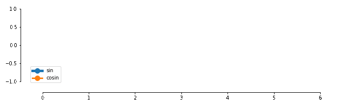

[&larr; previous](../10-11-Boxplots-Violinplots-and-Scatter-plots/10-11-Boxplots-Violinplots-and-Scatter-plots.md) - [home](https://guignardlab.github.io/CenTuri-Course-2022/) - next &rarr;

# Table of contents
* [1-2 Introduction and Line plots](../1-2-Intro-and-Line-plots/1-2-Intro-and-Line-plots.md)
* [3-4 Figures and Subplots](../3-4-Figures-and-Subplots/3-4-Figures-and-Subplots.md)
* [5-6 Styles and Aesthetics](../5-6-Styles-and-Aesthetics/5-6-Styles-and-Aesthetics.md)
* [7-8 Saving and Color maps](../7-8-Saving-and-Color-maps/7-8-Saving-and-Color-maps.md)
* [9 Histograms](../9-Histograms/9-Histograms.md)
* [10-11 Boxplots Violinplots and Scatter plots](../10-11-Boxplots-Violinplots-and-Scatter-plots/10-11-Boxplots-Violinplots-and-Scatter-plots.md)
* [12 Animations](../12-Animations/12-Animations.md) &larr; ([Notebook](../../12-Animations.ipynb))

## 12. Animations

### How to build the animations we made earlier?

First we need to load one of the patterns that we made earlier.
If you saved it your own way, you should be able to work out how to load it.
If you did not manage to save it (or to produce it in the first place), you can use the file `Turing_pattern.npy` in the folder `Resources`.
You can load this kind of files using the `numpy` function `load`:


```python
import numpy as np
import matplotlib as mpl
import matplotlib.pyplot as plt
```


```python
A = np.load('Resources/Turing_pattern.npy')
```

Now, the first step is to display just one time-point as a 2D image (in the following case it is the last time-point):


```python
fig, ax = plt.subplots(figsize=(5, 5))
ax.axis('off')
ax.imshow(A[:,:, -1], interpolation='bilinear')
```

There are a multiple parameters coming with `imshow`:


```python
plt.imshow?
```

You can play with them a little bit:


```python
# Here
```

Now the animation part:

The idea behind creating an animation is that you will be updating a pre-created figure with a pre-existing dataset. Here, in our case, the created figure will be our `imshow` figure and our dataset will be `A`, our Turing pattern.

Before starting doing anything, we will need to import the `animation` package from matplotlib (done in line `1` of the following cell) to create the animation. It is imported in the first line of the next cell.

Then, once we have created our animation, we will need to display it. To do so we will use the `HTML` function from the library `IPython.display`. It is imported in the second line of the next cell.

Now that we have all we need, we have to first create this initial figure as we did previously, that is what we do in the lines `4` to `7` of this plot: we create the figure of our pattern at the first time-point.

Then we need to create the function to update our image, not the figure itself (the function is named `update` in the next cell).
This update function modifies our image with the data at the adequate time-point `t`.
Note the coma at the end of the `return` statement. It is because multiple images/lines/scatter plots could be needed to be updated, in our case it is just one, it might not always be the case.

Once all that is in place, we need to define how many time-points we want to display (the more time-points, the longer it will take). It is our `nb_times_im` parameter in the next cell.

Before creating our animation, because we do not want to display all our time-points (it would be too long) we need to reduce our original image, which is done in line `14`.

Now we can create our animation (lines `15` to `17`), and display it (line `18`):


```python
from matplotlib import animation
from IPython.display import HTML

fig, ax = plt.subplots(figsize=(5, 5))
ax.axis('off')
im = ax.imshow(A[..., 0], interpolation='bilinear')
fig.tight_layout()

def update(t):
    im.set_data(A_anim[...,t])
    return im,

nb_times_im = 100
A_anim = A[..., ::A.shape[-1]//nb_times_im]
anim = animation.FuncAnimation(fig, update,
                               frames=nb_times_im, interval=50, 
                               blit=True)
HTML(anim.to_jshtml())
```

## Exercice:
Create your own animation of any plot you want. If you are out of idea, you can try to recreate the following one (or part of it):


Or something like this:


Or that:


Or even like the one proposed in [Nicolas Rougier's book](https://github.com/rougier/scientific-visualization-book):


```python
%run Resources/rain.py
HTML(anim.to_jshtml())
```

[&larr; previous](../10-11-Boxplots-Violinplots-and-Scatter-plots/10-11-Boxplots-Violinplots-and-Scatter-plots.md) - [home](https://guignardlab.github.io/CenTuri-Course-2022/) - next &rarr;