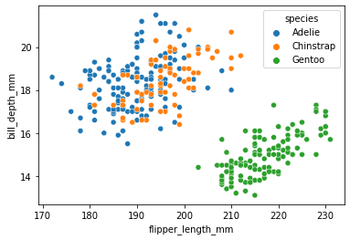
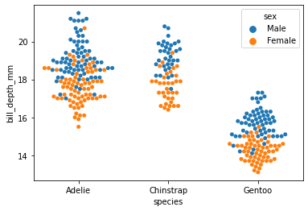
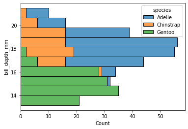
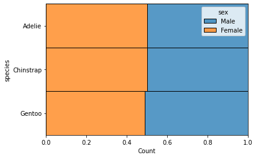
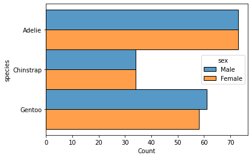
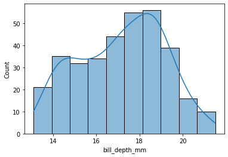
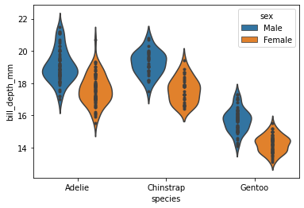
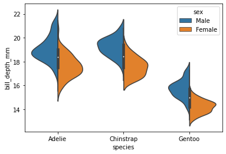
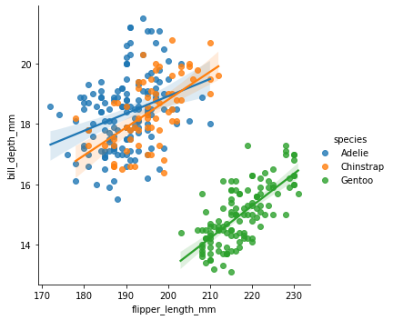

[&larr; previous](../12-Animations/12-Animations.md) - [home](https://guignardlab.github.io/CenTuri-Course/) - next &rarr;

# Table of contents
* [1-2 Introduction and Line plots](../1-2-Intro-and-Line-plots/1-2-Intro-and-Line-plots.md)
* [3-4 Figures and Subplots](../3-4-Figures-and-Subplots/3-4-Figures-and-Subplots.md)
* [5-6 Styles and Aesthetics](../5-6-Styles-and-Aesthetics/5-6-Styles-and-Aesthetics.md)
* [7-8 Saving and Color maps](../7-8-Saving-and-Color-maps/7-8-Saving-and-Color-maps.md)
* [9 Histograms](../9-Histograms/9-Histograms.md)
* [10-11 Boxplots Violinplots and Scatter plots](../10-11-Boxplots-Violinplots-and-Scatter-plots/10-11-Boxplots-Violinplots-and-Scatter-plots.md)
* [12 Animations](../12-Animations/12-Animations.md)
* [13 On the usage of Seaborn](../13-Seaborn/13-Seaborn.md) &larr; ([Notebook](../../../13-Seaborn.ipynb))
 
## On the usage of seaborn

Seaborn is a library to use matplotlib in an "easier" way.
You can find information about it [there](seaborn.pydata.org/).

Eventhough it does not have to be that way, it mainly uses pandas dataframes as input (more info [there](pandas.pydata.org/)).


```python
import pandas as pd
import seaborn as sns
```


```python
dataset = sns.load_dataset('penguins')
```


```python
dataset
```


<div>
<style scoped>
    .dataframe tbody tr th:only-of-type {
        vertical-align: middle;
    }

    .dataframe tbody tr th {
        vertical-align: top;
    }

    .dataframe thead th {
        text-align: right;
    }
</style>
<table border="1" class="dataframe">
  <thead>
    <tr style="text-align: right;">
      <th></th>
      <th>species</th>
      <th>island</th>
      <th>bill_length_mm</th>
      <th>bill_depth_mm</th>
      <th>flipper_length_mm</th>
      <th>body_mass_g</th>
      <th>sex</th>
    </tr>
  </thead>
  <tbody>
    <tr>
      <th>0</th>
      <td>Adelie</td>
      <td>Torgersen</td>
      <td>39.1</td>
      <td>18.7</td>
      <td>181.0</td>
      <td>3750.0</td>
      <td>Male</td>
    </tr>
    <tr>
      <th>1</th>
      <td>Adelie</td>
      <td>Torgersen</td>
      <td>39.5</td>
      <td>17.4</td>
      <td>186.0</td>
      <td>3800.0</td>
      <td>Female</td>
    </tr>
    <tr>
      <th>2</th>
      <td>Adelie</td>
      <td>Torgersen</td>
      <td>40.3</td>
      <td>18.0</td>
      <td>195.0</td>
      <td>3250.0</td>
      <td>Female</td>
    </tr>
    <tr>
      <th>3</th>
      <td>Adelie</td>
      <td>Torgersen</td>
      <td>NaN</td>
      <td>NaN</td>
      <td>NaN</td>
      <td>NaN</td>
      <td>NaN</td>
    </tr>
    <tr>
      <th>4</th>
      <td>Adelie</td>
      <td>Torgersen</td>
      <td>36.7</td>
      <td>19.3</td>
      <td>193.0</td>
      <td>3450.0</td>
      <td>Female</td>
    </tr>
    <tr>
      <th>...</th>
      <td>...</td>
      <td>...</td>
      <td>...</td>
      <td>...</td>
      <td>...</td>
      <td>...</td>
      <td>...</td>
    </tr>
    <tr>
      <th>339</th>
      <td>Gentoo</td>
      <td>Biscoe</td>
      <td>NaN</td>
      <td>NaN</td>
      <td>NaN</td>
      <td>NaN</td>
      <td>NaN</td>
    </tr>
    <tr>
      <th>340</th>
      <td>Gentoo</td>
      <td>Biscoe</td>
      <td>46.8</td>
      <td>14.3</td>
      <td>215.0</td>
      <td>4850.0</td>
      <td>Female</td>
    </tr>
    <tr>
      <th>341</th>
      <td>Gentoo</td>
      <td>Biscoe</td>
      <td>50.4</td>
      <td>15.7</td>
      <td>222.0</td>
      <td>5750.0</td>
      <td>Male</td>
    </tr>
    <tr>
      <th>342</th>
      <td>Gentoo</td>
      <td>Biscoe</td>
      <td>45.2</td>
      <td>14.8</td>
      <td>212.0</td>
      <td>5200.0</td>
      <td>Female</td>
    </tr>
    <tr>
      <th>343</th>
      <td>Gentoo</td>
      <td>Biscoe</td>
      <td>49.9</td>
      <td>16.1</td>
      <td>213.0</td>
      <td>5400.0</td>
      <td>Male</td>
    </tr>
  </tbody>
</table>
<p>344 rows × 7 columns</p>
</div>


```python
sns.scatterplot(data=dataset, x='flipper_length_mm', y='bill_depth_mm', hue='species')
```


    <AxesSubplot:xlabel='flipper_length_mm', ylabel='bill_depth_mm'>


    

    


```python
sns.swarmplot(data=dataset, x='species', y='bill_depth_mm', hue='sex')
```


    <AxesSubplot:xlabel='species', ylabel='bill_depth_mm'>


    

    


```python
sns.histplot(data=dataset, y='bill_depth_mm', hue='species', multiple='stack')
```


    <AxesSubplot:xlabel='Count', ylabel='bill_depth_mm'>


    

    


```python
sns.histplot(data=dataset, y='species', hue='sex', discrete=True, multiple='fill')
```


    <AxesSubplot:xlabel='Count', ylabel='species'>


    

    


```python
sns.histplot(data=dataset, y='species', hue='sex', discrete=True, multiple='dodge')
```


    <AxesSubplot:xlabel='Count', ylabel='species'>


    

    


```python
sns.histplot(data=dataset, x='bill_depth_mm', kde=True)
```


    <AxesSubplot:xlabel='bill_depth_mm', ylabel='Count'>


    

    


```python
sns.violinplot(data=dataset, y='bill_depth_mm', x='species', inner='points', hue='sex')
```


    <AxesSubplot:xlabel='species', ylabel='bill_depth_mm'>


    

    


```python
sns.violinplot(data=dataset, y='bill_depth_mm', x='species',
               hue='sex', split=True)
```


    <AxesSubplot:xlabel='species', ylabel='bill_depth_mm'>


    

    


```python
sns.lmplot(data=dataset, x='flipper_length_mm', y='bill_depth_mm', hue='species')
```


    <seaborn.axisgrid.FacetGrid at 0x2bc059480>


    

    

[&larr; previous](../12-Animations/12-Animations.md) - [home](https://guignardlab.github.io/CenTuri-Course/) - next &rarr;
