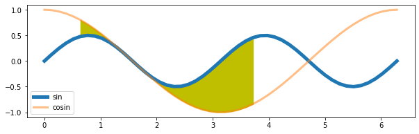

[&larr; previous](../3-4-Figures-and-Subplots/3-4-Figures-and-Subplots.md) - [home](https://guignardlab.github.io/CenTuri-Course/) - [next &rarr;](../7-8-Saving-and-Color-maps/7-8-Saving-and-Color-maps.md)

# Table of contents
* [1-2 Introduction and Line plots](../1-2-Intro-and-Line-plots/1-2-Intro-and-Line-plots.md)
* [3-4 Figures and Subplots](../3-4-Figures-and-Subplots/3-4-Figures-and-Subplots.md)
* [5-6 Styles and Aesthetics](../5-6-Styles-and-Aesthetics/5-6-Styles-and-Aesthetics.md) &larr; ([Notebook](../../../05-06-Styles-and-Aesthetics.ipynb))
* [7-8 Saving and Color maps](../7-8-Saving-and-Color-maps/7-8-Saving-and-Color-maps.md)
* [9 Histograms](../9-Histograms/9-Histograms.md)
* [10-11 Boxplots Violinplots and Scatter plots](../10-11-Boxplots-Violinplots-and-Scatter-plots/10-11-Boxplots-Violinplots-and-Scatter-plots.md)
* [12 Animations](../12-Animations/12-Animations.md)
* [13 On the usage of Seaborn](../13-Seaborn/13-Seaborn.md)

## 5. Plot styles
Different styles are available with matplotlib to customise your plots, you can list them with the command `plt.style.available`:


```python
import numpy as np
import matplotlib as mpl
import matplotlib.pyplot as plt
import seaborn as sns
```


```python
print(plt.style.available)
```

    ['Solarize_Light2', '_classic_test_patch', '_mpl-gallery', '_mpl-gallery-nogrid', 'bmh', 'classic', 'dark_background', 'fast', 'fivethirtyeight', 'ggplot', 'grayscale', 'seaborn', 'seaborn-bright', 'seaborn-colorblind', 'seaborn-dark', 'seaborn-dark-palette', 'seaborn-darkgrid', 'seaborn-deep', 'seaborn-muted', 'seaborn-notebook', 'seaborn-paper', 'seaborn-pastel', 'seaborn-poster', 'seaborn-talk', 'seaborn-ticks', 'seaborn-white', 'seaborn-whitegrid', 'tableau-colorblind10']


And you can use them with the command `plt.style.context`:


```python
with plt.style.context('seaborn-paper'):
    X1 = np.linspace(0, 2*np.pi)
    X2 = np.linspace(0, 2*np.pi)
    Y1 = np.sin(X1*2)/2
    Y2 = np.cos(X2)

    fig, ax = plt.subplots(figsize=(10, 3))
    ax.plot(X1, Y1, '-', label='sin', lw=5)
    ax.plot(X2, Y2, '-', label='cosin', lw=3, alpha=.5)
    ax.fill_between(X1[5:30], Y1[5:30], Y2[5:30], color='y')
    ax.legend()
```


    

    


```python
with plt.style.context('seaborn-poster'):
    X1 = np.linspace(0, 2*np.pi)
    X2 = np.linspace(0, 2*np.pi)
    Y1 = np.sin(X1*2)/2
    Y2 = np.cos(X2)

    fig, ax = plt.subplots(figsize=(10, 3), sharex=True, sharey=True)
    ax.plot(X1, Y1, '-', label='sin', lw=5)
    ax.plot(X2, Y2, '-', label='cosin', lw=3, alpha=.5)
    ax.fill_between(X1[5:30], Y1[5:30], Y2[5:30], color='y')
    ax.legend()
```


    

    


```python
with plt.style.context('dark_background'):
    X1 = np.linspace(0, 2*np.pi)
    X2 = np.linspace(0, 2*np.pi)
    Y1 = np.sin(X1*2)/2
    Y2 = np.cos(X2)

    fig, ax = plt.subplots(figsize=(10, 3))
    ax.plot(X1, Y1, '-', label='sin', lw=5)
    ax.plot(X2, Y2, '-', label='cosin', lw=3, alpha=.5)
    ax.fill_between(X1[5:30], Y1[5:30], Y2[5:30], color='y')
    ax.legend()
```


    

    


Note the use of the `with` statement.
It is not necessary, but if you want to use a given style for only one figure, that is the easiest way to do so.
If you do not put the `with` statement, you will keep the style for the whole session.

All these styles are based on parameters that are stored in `rcParams` and can be seen from the dictionary `plt.style.library`


```python
plt.style.library['dark_background']
```


    RcParams({'axes.edgecolor': 'white',
              'axes.facecolor': 'black',
              'axes.labelcolor': 'white',
              'axes.prop_cycle': cycler('color', ['#8dd3c7', '#feffb3', '#bfbbd9', '#fa8174', '#81b1d2', '#fdb462', '#b3de69', '#bc82bd', '#ccebc4', '#ffed6f']),
              'boxplot.boxprops.color': 'white',
              'boxplot.capprops.color': 'white',
              'boxplot.flierprops.color': 'white',
              'boxplot.flierprops.markeredgecolor': 'white',
              'boxplot.whiskerprops.color': 'white',
              'figure.edgecolor': 'black',
              'figure.facecolor': 'black',
              'grid.color': 'white',
              'lines.color': 'white',
              'patch.edgecolor': 'white',
              'savefig.edgecolor': 'black',
              'savefig.facecolor': 'black',
              'text.color': 'white',
              'xtick.color': 'white',
              'ytick.color': 'white'})


```python
plt.style.library['seaborn-poster']
```


    RcParams({'axes.labelsize': 17.6,
              'axes.titlesize': 19.2,
              'figure.figsize': [12.8, 8.8],
              'grid.linewidth': 1.6,
              'legend.fontsize': 16.0,
              'lines.linewidth': 2.8,
              'lines.markeredgewidth': 0.0,
              'lines.markersize': 11.2,
              'patch.linewidth': 0.48,
              'xtick.labelsize': 16.0,
              'xtick.major.pad': 11.2,
              'xtick.major.width': 1.6,
              'xtick.minor.width': 0.8,
              'ytick.labelsize': 16.0,
              'ytick.major.pad': 11.2,
              'ytick.major.width': 1.6,
              'ytick.minor.width': 0.8})


Each of these parameters can be checked and changed via `mpl.rcParams`:


```python
mpl.rcParams['lines.linestyle'] = '--'
X1 = np.linspace(0, 2*np.pi)
X2 = np.linspace(0, 2*np.pi)
Y1 = np.sin(X1*2)/2
Y2 = np.cos(X2)

fig, ax = plt.subplots(figsize=(10, 3))
ax.plot(X1, Y1, label='sin', lw=5)
ax.plot(X2, Y2, label='cosin', lw=3, alpha=.5)
ax.fill_between(X1[5:30], Y1[5:30], Y2[5:30], color='y')
ax.legend();
```


    

    


If you made too many changes and you do not remember what were the original settings you can call the function `mpl.rcdefaults()`:


```python
# mpl.rcdefaults()
mpl.rcParams['lines.linestyle'] = '-'
```


```python
X1 = np.linspace(0, 2*np.pi)
X2 = np.linspace(0, 2*np.pi)
Y1 = np.sin(X1*2)/2
Y2 = np.cos(X2)

fig, ax = plt.subplots(figsize=(10, 3))
ax.plot(X1, Y1, '-', label='sin', lw=5)
ax.plot(X2, Y2, '-', label='cosin', lw=3, alpha=.5)
ax.fill_between(X1[5:30], Y1[5:30], Y2[5:30], color='y')
ax.legend();
```


    

    


## 6. Changing the aesthetics of the figure
On top of the previous styles and parameters you can further customise your plots, for example you can remove the frame:


```python
X1 = np.linspace(0, 2*np.pi)
X2 = np.linspace(0, 2*np.pi)
Y1 = np.sin(X1*2)/2
Y2 = np.cos(X2)

fig, ax = plt.subplots(figsize=(10, 3))
ax.plot(X1, Y1, '-', label='sin', lw=5)
ax.plot(X2, Y2, '-', label='cosin', lw=3, alpha=.5)
ax.fill_between(X1[5:30], Y1[5:30], Y2[5:30], color='y')
# Here is the line to remove the frame:
ax.set_frame_on(False)
# And the lines to remove the ticks in the x and y axes
ax.set_xticks([])
ax.set_yticks([])
ax.legend();
```


    

    


Or just the right and top part of the frame:


```python
X1 = np.linspace(0, 2*np.pi)
X2 = np.linspace(0, 2*np.pi)
Y1 = np.sin(X1*2)/2
Y2 = np.cos(X2)

fig, ax = plt.subplots(figsize=(10, 3))
ax.plot(X1, Y1, '-', label='sin', lw=5)
ax.plot(X2, Y2, '-', label='cosin', lw=3, alpha=.5)
ax.fill_between(X1[5:30], Y1[5:30], Y2[5:30], color='y')
ax.spines['right'].set_visible(False)
ax.spines['top'].set_visible(False)
ax.legend();
```


    

    


Offsetting the axes:


```python
X1 = np.linspace(0, 2*np.pi)
X2 = np.linspace(0, 2*np.pi)
Y1 = np.sin(X1*2)/2
Y2 = np.cos(X2)

fig, ax = plt.subplots(figsize=(10, 3))
ax.plot(X1, Y1, '-', label='sin', lw=5)
ax.plot(X2, Y2, '-', label='cosin', lw=3, alpha=.5)
ax.fill_between(X1[5:30], Y1[5:30], Y2[5:30], color='y')
ax.spines['right'].set_visible(False)
ax.spines['top'].set_visible(False)
# Here is the offset
ax.spines['bottom'].set_position(('outward', 15))
ax.spines['left'].set_position(('outward', 15))
ax.legend();
```


    

    


Even triming the axes (slightly more complicated):


```python
X1 = np.linspace(0, 2*np.pi)
X2 = np.linspace(0, 2*np.pi)
Y1 = np.sin(X1*2)/2
Y2 = np.cos(X2)

fig, ax = plt.subplots(figsize=(10, 3))
ax.plot(X1, Y1, '-', label='sin', lw=5)
ax.plot(X2, Y2, '-', label='cosin', lw=3, alpha=.5)
ax.fill_between(X1[5:30], Y1[5:30], Y2[5:30], color='y')
ax.spines['right'].set_visible(False)
ax.spines['top'].set_visible(False)
ax.spines['bottom'].set_position(('outward', 15))
ax.spines['left'].set_position(('outward', 15))

# getting the x ticks
xticks = np.asarray(ax.get_xticks())
# getting the first and last ticks to know where to trim
firsttick = xticks[min(ax.get_xlim()) <= xticks][0]
lasttick = xticks[xticks <= max(ax.get_xlim())][-1]
# setting the bounds of the x axis
ax.spines['bottom'].set_bounds(firsttick, lasttick)
# cleaning the ticks (sometimes they are unshown ticks)
xticks = xticks[(firsttick <= xticks) & (xticks <= lasttick)]
ax.set_xticks(xticks)

# same for y axis
yticks = np.asarray(ax.get_yticks())
firsttick = yticks[min(ax.get_ylim()) <= yticks][0]
lasttick = yticks[yticks <= max(ax.get_ylim())][-1]
ax.spines['left'].set_bounds(firsttick, lasttick)
yticks = yticks[(firsttick <= yticks) & (yticks <= lasttick)]
ax.set_yticks(yticks)

ax.legend();
```


    

    


There is another way to do that using `seaborn`, but we will explore that later if we have time:


```python
X1 = np.linspace(0, 2*np.pi)
X2 = np.linspace(0, 2*np.pi)
Y1 = np.sin(X1*2)/2
Y2 = np.cos(X2)

fig, ax = plt.subplots(figsize=(10, 3))
ax.plot(X1, Y1, '-', label='sin', lw=5)
ax.plot(X2, Y2, '-', label='cosin', lw=3, alpha=.5)
ax.fill_between(X1[5:30], Y1[5:30], Y2[5:30], color='y')
sns.despine(trim=True, offset=15, ax=ax)
ax.legend();
```


    

    


[&larr; previous](../3-4-Figures-and-Subplots/3-4-Figures-and-Subplots.md) - [home](https://guignardlab.github.io/CenTuri-Course/) - [next &rarr;](../7-8-Saving-and-Color-maps/7-8-Saving-and-Color-maps.md)