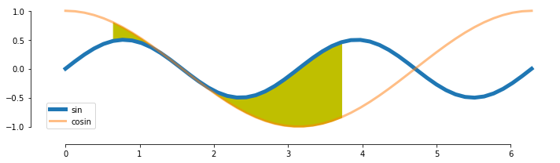
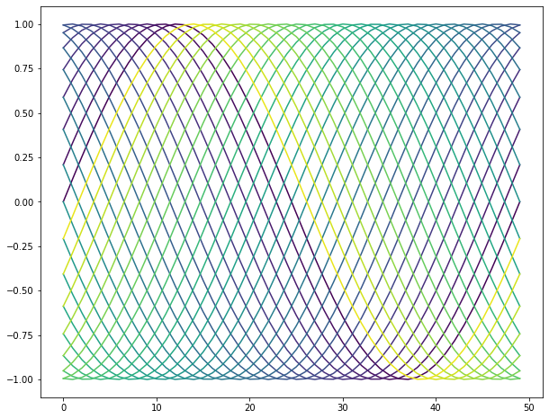

[&larr; previous](../5-6-Styles-and-Aesthetics/5-6-Styles-and-Aesthetics.md) - [home](https://guignardlab.github.io/CenTuri-Course-2022/) - [next &rarr;](../9-Histograms/9-Histograms.md)

# Table of contents
* [1-2 Introduction and Line plots](../1-2-Intro-and-Line-plots/1-2-Intro-and-Line-plots.md)
* [3-4 Figures and Subplots](../3-4-Figures-and-Subplots/3-4-Figures-and-Subplots.md)
* [5-6 Styles and Aesthetics](../5-6-Styles-and-Aesthetics/5-6-Styles-and-Aesthetics.md)
* [7-8 Saving and Color maps](../7-8-Saving-and-Color-maps/7-8-Saving-and-Color-maps.md) &larr;
* [9 Histograms](../9-Histograms/9-Histograms.md)
* [10-11 Boxplots Violinplots and Scatter plots](../10-11-Boxplots-Violinplots-and-Scatter-plots/10-11-Boxplots-Violinplots-and-Scatter-plots.md)
* [12 Animations](../12-Animations/12-Animations.md)

## 7. Preparing and saving a figure
Once we are happy with our figure, we can save it with `fig.savefig`. The function `fig.savefig` can take multiple out formats such as png, jpeg, pdf or svg:


```python
import numpy as np
import matplotlib as mpl
import matplotlib.pyplot as plt
import seaborn as sns
```


```python
X1 = np.linspace(0, 2*np.pi)
X2 = np.linspace(0, 2*np.pi)
Y1 = np.sin(X1*2)/2
Y2 = np.cos(X2)

fig, ax = plt.subplots(figsize=(10, 3))
ax.plot(X1, Y1, '-', label='sin', lw=5)
ax.plot(X2, Y2, '-', label='cosin', lw=3, alpha=.5)
ax.fill_between(X1[5:30], Y1[5:30], Y2[5:30], color='y')
sns.despine(trim=True, offset=15, ax=ax)
ax.legend();
fig.savefig('Sin-test.pdf')
fig.savefig('Sin-test.png')
fig.savefig('Sin-test.jpeg')
```


    

    


You should see that the figure actually does not fit in the figure produced. It can happen sometimes (we choose here an example when it happens). There is a very efficient and practical way to solve the issue: `fig.tight_layout`:


```python
import seaborn as sns
X1 = np.linspace(0, 2*np.pi)
X2 = np.linspace(0, 2*np.pi)
Y1 = np.sin(X1*2)/2
Y2 = np.cos(X2)

fig, ax = plt.subplots(figsize=(10, 3))
ax.plot(X1, Y1, '-', label='sin', lw=5)
ax.plot(X2, Y2, '-', label='cosin', lw=3, alpha=.5)
ax.fill_between(X1[5:30], Y1[5:30], Y2[5:30], color='y')
sns.despine(trim=True, offset=15, ax=ax)
ax.legend();
fig.tight_layout()
fig.savefig('Sin-test-2.png')
```


    

    


The function `fig.tight_layout` actually takes your current figure and adjusts it so that it fits as best as possible within your output figure layout, conserving all the current properties of the figure (the scaling for example). What it means is that to be as efficient as possible, this function should be called just before saving the figure.

Moreover, there are multiple potentially useful options to save a figure for example:
- `dpi`: gives the resolution of the figure in dots per inch. The higher the value is the higher the quality but also the higher the weight of the figure (the dpi makes less sense when plotting in vectorial formats such as `pdf`)
- `transparent`: a boolean, if `True` then all the background of the figure is transparent (if it was not given an colour)

## 8. Using colormaps
Choosing colours can be a fairly hard task. Thankfully, matplotlib has a handful of colormaps already made for us, you can find them [there](https://matplotlib.org/stable/tutorials/colors/colormaps.html).

The way colormaps usually work within matplotlib is by giving a colour code provided a value between 0 and 1.
In other words, the colormap is a linear mapping between the interval $[0, 1]$ and the colours of the colormap.

Here is an example on how to use them:


```python
# here, we get the colormap
cmap = mpl.cm.get_cmap('viridis')

X = np.linspace(0, 2*np.pi)
nb_curves = 30
fig, ax = plt.subplots(figsize=(10, 8))
for i in range(nb_curves):
    curve = np.sin(X + i*2*np.pi/nb_curves)
    color = cmap(i/nb_curves)
    ax.plot(curve, color=color)
```


    

    


While, unfortunately, I don't know a way of listing all the available colormaps in matplotlib (you should therefore go [there](https://matplotlib.org/stable/tutorials/colors/colormaps.html)), calling `mpl.cm.get_cmap` without assigning it to a variable plots the colormap:


```python
mpl.cm.get_cmap('Spectral')
```


<div style="vertical-align: middle;"><strong>Spectral</strong> </div><div class="cmap"></div><div style="vertical-align: middle; max-width: 514px; display: flex; justify-content: space-between;"><div style="float: left;"><div title="#9e0142ff" style="display: inline-block; width: 1em; height: 1em; margin: 0; vertical-align: middle; border: 1px solid #555; background-color: #9e0142ff;"></div> under</div><div style="margin: 0 auto; display: inline-block;">bad <div title="#00000000" style="display: inline-block; width: 1em; height: 1em; margin: 0; vertical-align: middle; border: 1px solid #555; background-color: #00000000;"></div></div><div style="float: right;">over <div title="#5e4fa2ff" style="display: inline-block; width: 1em; height: 1em; margin: 0; vertical-align: middle; border: 1px solid #555; background-color: #5e4fa2ff;"></div></div>


### Exercise 1:
Make a plot that resemble the following one:


To do so you will need to use the parameter `zorder` from `ax.plot` and `ax.fill_between`.
You can find some documentation [there](https://matplotlib.org/stable/gallery/misc/zorder_demo.html).

You can find in `Resources.UsefulFunctions` the function `build_curve` to help you generate random curves. That being said, you building such a function would be a good training (that's why it is not directly accessible from the help, to prevent a bit the temptation)


```python
np.random.seed(1)
from Resources.UsefulFunctions import build_curve
...
```


    Ellipsis


Now, we know more or less how to plot curves using matplotlib.
While looking at curves is interesting it might not encapsulate everything you would need.
For example, when looking at the distribution of a given variable, curves are less useful.
There are many other ways to plot data, we will go through some amount of it through this session.

If there are specific types of plots that you can think of that we will not deal with during this course, feel free to let me know.

Here is the list of plots that we will look at:
- uni-dimensional datas:
    - histograms
    - boxplot
    - violin plot
- bi-dimensional datas:
    - scatterplot
    
We will __*NOT*__ look at barplots.

[&larr; previous](../5-6-Styles-and-Aesthetics/5-6-Styles-and-Aesthetics.md) - [home](https://guignardlab.github.io/CenTuri-Course-2022/) - [next &rarr;](../9-Histograms/9-Histograms.md)