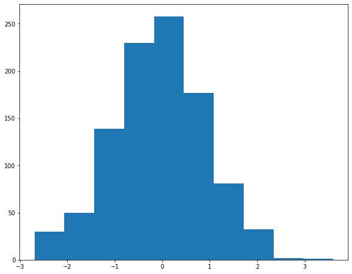
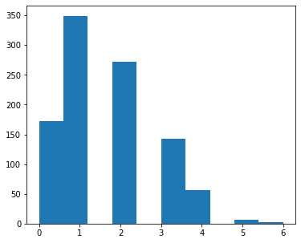
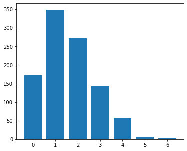
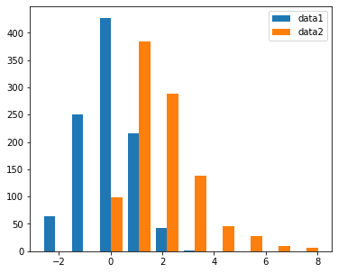
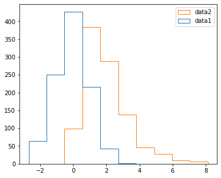
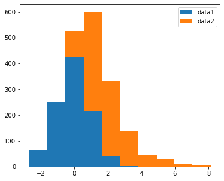
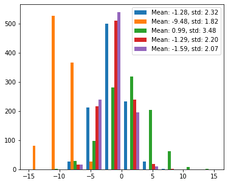
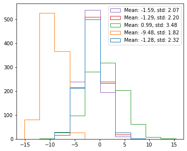
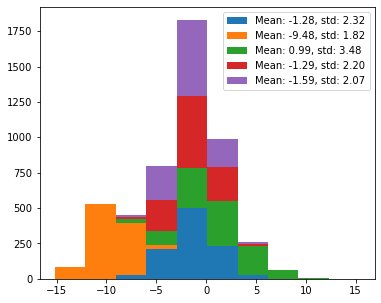
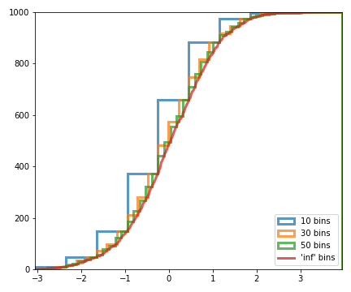

[&larr; previous](../7-8-Saving-and-Color-maps/7-8-Saving-and-Color-maps.md) - [home](https://guignardlab.github.io/CenTuri-Course/) - [next &rarr;](../10-11-Boxplots-Violinplots-and-Scatter-plots/10-11-Boxplots-Violinplots-and-Scatter-plots.md)

# Table of contents
* [1-2 Introduction and Line plots](../1-2-Intro-and-Line-plots/1-2-Intro-and-Line-plots.md)
* [3-4 Figures and Subplots](../3-4-Figures-and-Subplots/3-4-Figures-and-Subplots.md)
* [5-6 Styles and Aesthetics](../5-6-Styles-and-Aesthetics/5-6-Styles-and-Aesthetics.md)
* [7-8 Saving and Color maps](../7-8-Saving-and-Color-maps/7-8-Saving-and-Color-maps.md)
* [9 Histograms](../9-Histograms/9-Histograms.md) &larr; ([Notebook](../../../09-Histograms.ipynb))
* [10-11 Boxplots Violinplots and Scatter plots](../10-11-Boxplots-Violinplots-and-Scatter-plots/10-11-Boxplots-Violinplots-and-Scatter-plots.md)
* [12 Animations](../12-Animations/12-Animations.md)
* [13 On the usage of Seaborn](../13-Seaborn/13-Seaborn.md)

Histograms are a good way to look at a given distribution.


```python
import numpy as np
import matplotlib.pyplot as plt
```


```python
# creating some random data taken from a normal distribution
# centered in 0 with a standard deviation of 1
data1 = np.random.normal(size=(1000))
```


```python
fig, ax = plt.subplots(figsize=(10, 8))
ax.hist(data1);
```


    

    


Multiple parameters of the histogram can of course be changed.
For example the colour, whether it is cumulative or not, filled or not, the number of bins, [...]

Be careful with histograms, they are best suited to look at continuous datasets.
Weird things can happen with discrete datasets, especially when keeping the default parameters.

Look at the following example (note that the [binomial distribution](https://en.wikipedia.org/wiki/Binomial_distribution) is a discrete distribution):


```python
np.random.seed(0)
data2 = np.random.binomial(8, .2, size=1000)
fig, ax = plt.subplots(figsize=(6, 5))
ax.hist(data2)
```


    (array([172., 349.,   0., 272.,   0., 142.,  56.,   0.,   6.,   3.]),
     array([0. , 0.6, 1.2, 1.8, 2.4, 3. , 3.6, 4.2, 4.8, 5.4, 6. ]),
     <BarContainer object of 10 artists>)


    

    


One way to deal with that is to have as many bins as you have observations, have a range that span the range of your data and reduce the size of your bins to show the discrete nature of your data:


```python
fig, ax = plt.subplots(figsize=(6, 5))
data_range = np.min(data2), np.max(data2) +1
nb_bins = data_range[1] - data_range[0]
ax.hist(data2, bins=nb_bins, range=data_range, rwidth=.8, align='left');
```


    

    


To look at two different distributions, histograms can do the job but they might not be the best


```python
np.random.seed(0)
data3 = np.random.gamma(2, size=1000)
fig, ax = plt.subplots(figsize=(6, 5))
ax.hist([data1, data3], label=('data1', 'data2'))
ax.legend()
```


    <matplotlib.legend.Legend at 0x10fcde350>


    

    


Different histogram type can be chosen with the `histtype` parameter:


```python
fig, ax = plt.subplots(figsize=(6, 5))
ax.hist([data1, data3], label=('data1', 'data2'), histtype='step')
ax.legend()
```


    <matplotlib.legend.Legend at 0x10fcfe410>


    

    


```python
fig, ax = plt.subplots(figsize=(6, 5))
ax.hist([data1, data3], label=('data1', 'data2'), histtype='barstacked')
ax.legend()
```


    <matplotlib.legend.Legend at 0x10fe36770>


    

    


Moreover, the more distributions you add, the worse visible it gets:


```python
np.random.seed(2)
mean = np.random.uniform(-10, 10, size=5)
std = np.random.uniform(1, 5, size=5)
data = np.random.normal(loc=mean, scale=std, size=(1000, 5))
labels = [f'Mean: {m:.2f}, std: {s:.2f}' for m, s in zip(mean, std)]
```


```python
fig, ax = plt.subplots(figsize=(6, 5))
ax.hist(data, label=labels)
ax.legend()
```


    <matplotlib.legend.Legend at 0x10fe8d180>


    

    


```python
fig, ax = plt.subplots(figsize=(6, 5))
ax.hist(data, histtype='step', label=labels)
ax.legend()
```


    <matplotlib.legend.Legend at 0x10ff763b0>


    

    


```python
fig, ax = plt.subplots(figsize=(6, 5))
ax.hist(data, histtype='barstacked', label=labels)
ax.legend()
```


    <matplotlib.legend.Legend at 0x10ffe7340>


    

    


## Exercise 2:

Plot the following cumulative histograms (note that to plot the infinite bins you need to use `plot` and not `hist`):




```python
## Write your solution here
```

[&larr; previous](../7-8-Saving-and-Color-maps/7-8-Saving-and-Color-maps.md) - [home](https://guignardlab.github.io/CenTuri-Course/) - [next &rarr;](../10-11-Boxplots-Violinplots-and-Scatter-plots/10-11-Boxplots-Violinplots-and-Scatter-plots.md)