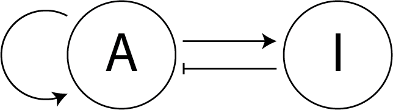

# Introduction to Python using Turing patterns

## 1. Introduction

**First of, within this course [this page](https://docs.python.org/3/tutorial/index.html) will be mentioned a lot. It is a really good (maybe a bit crude) source for informations and it is the official Python page so it is also likely to be quite accurate.**

### 1.1 Goal of this course

This course aim at teaching the basics of coding using reaction diffusion simulations as a support, more specifically the Turing patterns.
The mathematics or the biology behind the Turing patterns is not necessary but it might help to understand better what is happening behind the hood.

At the end of the course, we would like you to be able to write small pieces of code to do basic data analysis.
No computation level is required though it is good to keep in mind that at the time being, this notebook alone might not be enough: the teachers are still necessary (unfortunately?) to introduce the concepts and to help answering the potential questions.

### 1.2 Turing patterns

Now about Turing patterns, they were introduced by Alan Turing in the article [The Chemical Basis of Morphogenesis](https://www.dna.caltech.edu/courses/cs191/paperscs191/turing.pdf).
They will not been much discussed here but fill free to ask questions or to look over [there](https://en.wikipedia.org/wiki/Reaction%E2%80%93diffusion_system) for more information.

What is important to keep in mind is that a Turing pattern is the result of the interaction between an activator and its inhibitor and their co-diffusion across a set of cells.

It is this interaction and diffusion that we will model in this course. We will also learn how to represent these patterns.

A little bit of knowledge about how to model these interactions is necessary to better understand the remaining of the course.
First, we will be talking about an activator that will name *A* and an inhibitor that will name *I*. Their concentration values will be refered to as *a* and *i* respectively.

The gene regulation network that we are considering here is the simple one where *A* auto-activates and activates *I* and *I* inhibits *A*:



## 2. Requirements for the course.

### 2.1 Recommended software

This course is made on a [jupyter notebook](https://jupyter.org/) running on Python 3.5 or newer.

To install the required dependencies we recommend to use [conda](https://docs.conda.io/en/latest/), [mamba](https://mamba.readthedocs.io/en/latest/) or [pipenv](https://pipenv.pypa.io/en/latest/).

### 2.2 Installing conda

Conda can be installed multiple ways. We do not have any recommendations about how to but one can read [there](https://docs.conda.io/projects/conda/en/latest/user-guide/install/index.html) for a likely exhaustive list on ways to install conda. That being said, we do have a slight preference towards [Miniconda](https://docs.conda.io/en/latest/miniconda.html) but that's just us.

### 2.3 Dependencies

While we tried to keep the dependencies as small as possible, few are still required:

- [Jupyter notebook](https://jupyter.org/)

- [NumPy](https://numpy.org/) 

- [Matplotlib](https://matplotlib.org/)

To install them one can for example run the following command lines in a terminal, assuming that conda is installed:

```shell
conda create --name CenTuri-Course
```

to create the environement for the course. Then:

```shell
conda activate CenTuri-Course
```

to activate the course environement. And finally:

```shell
conda install notebook numpy matplotlib
```

All dependencies should now be installed!

## 3. Starting the course

Now that everything should be installed you can start the course by running

```shell
jupyter notebook Turing-course.ipynb
```

Enjoy!
