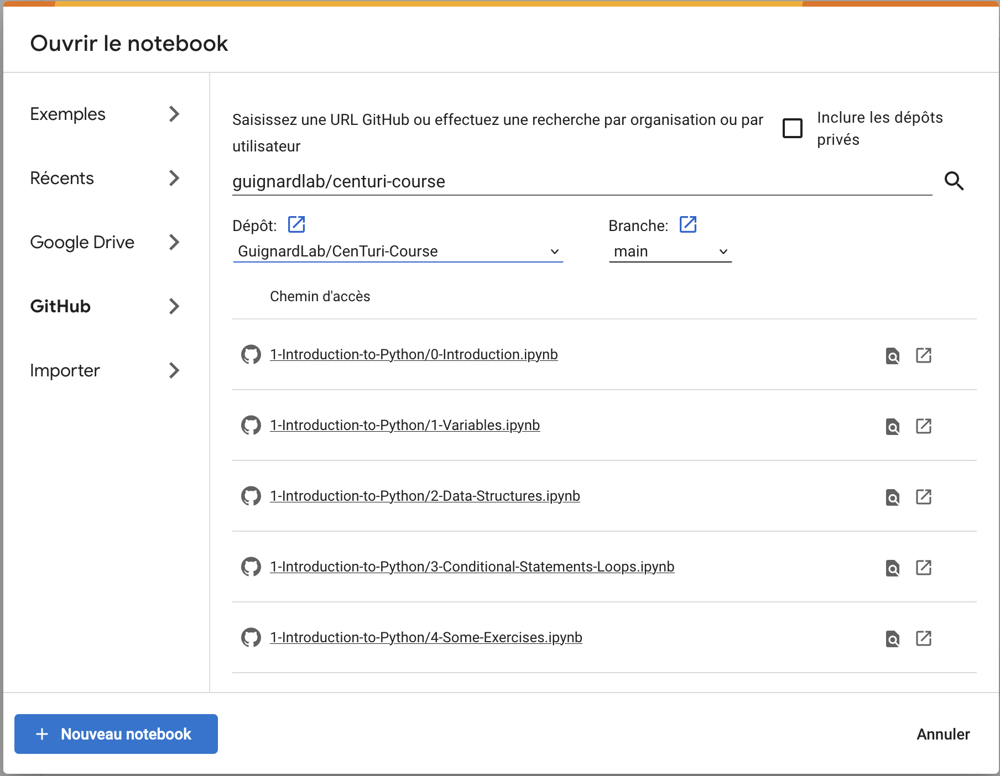

# Turing Centre for living systems's "Introduction to biological data analysis" course

<!-- The website version [here](https://guignardlab.github.io/CenTuri-Course/) -->

This is the repository for the introduction of the CENTURI "Introduction to biological data analysis" course.

This first day is split in 2 main parts:

1. [Introduction to coding with Turing patterns](1-Introduction-to-Python/Resources/0-Introduction.md)
2. [Data handling and visualisation](2-Data-handling-and-visu/Resources/Matplotlib-course/1-2-Intro-and-Line-plots/1-2-Intro-and-Line-plots.md)

## 0. Requirements for the course

### 0.1 Recommended software

This course is made on a [jupyter notebook](https://jupyter.org/) running on Python 3.8 or newer.

You can either run the notebooks using [google colab](https://colab.research.google.com).

From there you can open the notebooks by selecting the GitHub tab then typing GuignardLab/Centuri-Course:



If you don't want to use google colab you can run the software directly on your computer by first cloning this repository:

```shell
git clone https://github.com/GuignardLab/CenTuri-Course.git
```

Then, to install Python and the required dependencies we strongly recommend to use [conda](https://docs.conda.io/en/latest/),
[mamba](https://mamba.readthedocs.io/en/latest/) or [pipenv](https://pipenv.pypa.io/en/latest/) (the teachers will use conda)

### 0.2 Installing conda

Conda can be installed multiple ways. We do not have any recommendations about how to but one can read [there](https://docs.conda.io/projects/conda/en/latest/user-guide/install/index.html) for a likely exhaustive list on ways to install conda.

Note that we do not necessarily recommend installing Anaconda, we do have a slight preference towards [Miniconda](https://docs.conda.io/en/latest/miniconda.html) but that's just us.

Moreover, we advise to start jupyter notebooks from a shell/terminal/prompt to be able to better see the error messages.

### 0.3 Dependencies

To install them one can for example run the following command lines in a terminal, assuming that conda is installed:

```shell
conda create --name CenTuri-Course python=3.10
```

to create the environment for the course. Then:

```shell
conda activate CenTuri-Course
```

to activate the course environment. And finally:

```shell
pip install centuri_course
```

All dependencies should now be installed!

You can then start the notebooks by running:

```shell
jupyter notebook 1-Introduction-to-Python
```

Enjoy!
